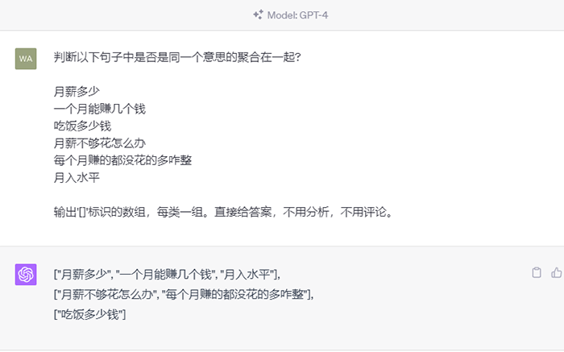

# 大模型应用开发基础

## 💡 这节课会带给你

1. 整体了解大模型应用开发技术栈和学习方法
2. 大模型的能力边界
3. 搭建自己的开发环境
4. 浅尝 OpenAI API 的调用和python的界面开发。

开始上课！

## 一、整体了解大模型应用开发技术栈和学习方法
### 1.1、大模型应用开发技术栈

在图中找到自己的地盘。


## 1.2、学习方法

| 学员 | 感受 | 建议 |
| ---------- | --------------------- | ----------------------- |
| 有明确的项目需求 | 你会感觉课程进度太慢，不能直接解决自己的问题 | 加我微信18510211925，约我1v1 |
| 没有明确项目需求，找工作、技术提升 | 可能会有听不懂 | 别着急，一定要完成作业，不会就立刻问 |

学习建议：

1. 原理一定要用心学。除了 Fine-tuning 原理外，都不算难
2. 认知一定要用心领悟。这是这门课最领先的地方
3. 编程和工程经验不足，练！练！练！没有捷径

## 二、大模型能干什么？

大模型，全称「大语言模型」，英文「Large Language Model」，缩写「LLM」。

现在，已经不需要再演示了。每人应该都至少和下面一个基于大模型的对话产品，对话过至少 100 次。

| 国家 | 对话产品           | 大模型         | 链接                                                             |
| ---- | ------------------ | -------------- | ---------------------------------------------------------------- |
| 美国 | OpenAI ChatGPT     | GPT-3.5、GPT-4 | [https://chat.openai.com/](https://chat.openai.com/)             |
| 美国 | Microsoft Copilot  | GPT-4 和未知   | [https://copilot.microsoft.com/](https://copilot.microsoft.com/) |
| 美国 | Google Bard        | Gemini         | [https://bard.google.com/](https://bard.google.com/)             |
| 中国 | 百度文心一言       | 文心 4.0       | [https://yiyan.baidu.com/](https://yiyan.baidu.com/)             |
| 中国 | 讯飞星火           | 星火 3.5       | [https://xinghuo.xfyun.cn/](https://xinghuo.xfyun.cn/)           |
| 中国 | 智谱清言           | GLM-4          | [https://chatglm.cn/](https://chatglm.cn/)                       |
| 中国 | 月之暗面 Kimi Chat | Moonshot       | [https://kimi.moonshot.cn/](https://kimi.moonshot.cn/)           |
| 中国 | MiniMax 星野       | abab6          | [https://www.xingyeai.com/](https://www.xingyeai.com/)           |

本课第一个专业向要求：分清**对话产品**和**大模型**。

但是，千万别以为大模型只是聊天机器人。它的能量，远不止于此。


### 2.1、按格式输出


### 2.2、分类


### 2.3、聚类



### 2.4、持续互动


### 2.5、技术相关问题


### 2.6、更多举例

- **舆情分析：**从公司产品的评论中，分析哪些功能/元素是用户讨论最多的，评价是正向还是负向
- **坐席质检：**检查客服/销售人员与用户的对话记录，判断是否有争吵、辱骂、不当言论，话术是否符合标准
- **知识库：**让大模型基于私有知识回答问题
- **零代码开发/运维：**自动规划任务，生成指令，自动执行
- **AI 编程：**用 AI 编写代码，提升开发效率

<div class="alert alert-warning">
<b>思考：</b>你的业务中，有哪些问题可以用 AI 解决？
</div>


### 2.7、可能一切问题，都能解决，所以是 AGI（Artificial General Intelligence）

<div class="alert alert-success">
<b>划重点：</b>
<ol>
<li>把大模型看做是一个万能函数，给输入，<b>生成</b>输出</li>
<li>任何问题，都可以用语言描述，成为大模型的输入，就能<b>生成</b>问题的结果</li>
</ol>
</div>

这当然还是美好的理想，但正在无限逼近。我们很幸运，能亲历这个过程。

当下，如何发挥大模型的现有能力呢？最大障碍是没有形成认知对齐。


<div class="alert alert-success">
<b>找落地场景的思路：</b>
<ol>
<li>从最熟悉的领域入手</li>
<li>让 AI 学最厉害员工的能力，再让 ta 辅助其他员工，实现降本增效</li>
<li>找「文本进、文本出」的场景</li>
<li>别求大而全。将任务拆解，先解决小任务、小场景（周鸿祎：「小切口，大纵深」）</li>
</ol>
</div>


## 三、环境安装

### 3.1、网络
<div class="alert alert-warning">
<b>建议：</b>
<ul>
<li>建议要有一个访问国外的「通道」，否则无法有顶级体验</li>
</ul>
</div>

<div>实在找不到【科学上网】，试试这个</div>


### 代理功能
- 全局代理
- 支持美国、欧洲、日本、新加坡、韩国...


### 3.2、大模型基座
<div class="alert alert-warning">
<b>建议：</b>
<ul>
<li>如果不能访问 ChatGPT，不是 ChatGPT Plus 会员，会非常遗憾</li>
<li><a href="https://copilot.microsoft.com/">Microsoft Copilot</a> 是 ChatGPT 免费平替，用的也是宇宙最强 GPT-4 大模型</li>
</ul>
</div>

**如何获取OpenAI APIKey**

#### 注册OpenAI 账号
- 官网注册地址：https://auth0.openai.com/u/signup/identifier?state=hKFo2SBIbkotZTNrRjI1Smp4Mm4tQUpzdHlfSzNTNHQ1VG83a6Fur3VuaXZlcnNhbC1sb2dpbqN0aWTZIDFmbjRqZklWZk9PTG9lMERkRVRnRVo2UzdtbWpEVWdxo2NpZNkgRFJpdnNubTJNdTQyVDNLT3BxZHR3QjNOWXZpSFl6d0Q
- 注册Gmail
- 需要国外的手机号，我们需要一个虚拟的接码平台，https://sms-activate.org/cn， 注册并且购买一个虚拟的手机号，等待接受OpenAI发送的手机验证码，填写完成注册

#### 使用 OpenAI API
- 登录后进入：https://platform.openai.com/api-keys
- 点击 Create new secret key
- 这个创建之后是可以使用的
- 但是试用后会需要你关联自己的信用卡，并且这个卡要求必须是OpenAI 允许的国家的本地信用卡
- 海外支付平台：https://www.nobepay.com/app/card-list，创建一张虚拟信用卡，并且充值，把卡信息关联到 OpenAI的账户上
- 小Tips：关联信用卡时，网络连接最好和卡片的注册地址一致；使用浏览器的无痕窗口关联；如果不行，可以咨询下海外支付平台的客服
- 钱不要充太多

关联后就可以随心玩了，模型都可以使用。


**如果觉得太复杂**

去国内代理 https://devcto.com/ ，文档地址 https://docs.devcto.com/
- 访问限制：解决了大陆地区用户无法直接访问OpenAI API（https://api.openai.com）的问题
- 支付限制：针对OpenAI服务的充值需要使用国外发行银行卡的问题，DevAGI提供了解决方案，支持更多本地支付方式，简化了充值过程。
- 价格优惠：提供的服务价格是官方标价的4折，对于价格敏感的用户来说极具吸引力，使得用户能够以更低的成本享受到AI服务。
- 高调用速率：提供了极高的调用速率，达到每分钟最多40000次调用（如果直接使用官方，普通用户每分钟最多100次调用），满足了需要大量AI计算能力的企-业或开发者的需求。

**不想花钱**

使用月之暗面代替，官方控制台 https://platform.moonshot.cn/console/api-keys，
[目前的优惠政策](https://platform.moonshot.cn/docs/pricing#%E5%85%85%E5%80%BC%E4%B8%8E%E9%99%90%E9%80%9F)

- 通义
- 文心
- 豆包（Coze）

### 3.3、开发环境

- 课上的 python 版本使用 3.8、3.9。
- 使用 miniconda 来管理python的环境，安装教程 https://docs.conda.io/projects/conda/en/latest/user-guide/install/index.html。
- 云端操作使用 jupyterlab，使用 `conda install jupyterlab` 来安装，启动命令 `jupyter lab --ip 0.0.0.0 --port 9090 --allow-root`
- 本地IDE 使用 Cursor，下载地址 https://cursor.sh/
- 腾讯tione用来做大模型微调 https://console.cloud.tencent.com/tione/v2/notebook/create?regionId=1。

## 四、大模型是怎么生成结果的？

### 4.1、通俗原理

其实，它只是根据上文，猜下一个词（的概率）……


OpenAI 的接口名就叫「completion」，也证明了其只会「生成」的本质。

下面用程序演示「生成下一个字」。你可以自己修改 prompt 试试。还可以使用相同的 prompt 运行多次。


```python
!conda install openai python-dotenv -y
```


```python
!conda install openai python-dotenv -y
```


```python
from openai import OpenAI
from dotenv import load_dotenv, find_dotenv

# 加载我们的环境变量 .env 文件
_ = load_dotenv(find_dotenv())

# 客户端
client = OpenAI()

prompt = "今天我很"  # 改我试试
# prompt = "下班了，今天我很"
# prompt = "放学了，今天我很"
# prompt = "AGI 实现了，今天我很"
response = client.completions.create(
    model="deepseek-ai/DeepSeek-R1",
    prompt=prompt,
    # 我prompt+response的token
    max_tokens=512,
    stream=True
)

for chunk in response:
    print(chunk.choices[0].text, end='')
```


```python
from openai import OpenAI
from dotenv import load_dotenv, find_dotenv

# 加载我们的环境变量 .env 文件
_ = load_dotenv(find_dotenv())

# 客户端
client = OpenAI()

prompt = "今天我很"  # 改我试试
# prompt = "下班了，今天我很"
# prompt = "放学了，今天我很"
# prompt = "AGI 实现了，今天我很"
response = client.completions.create(
    model="deepseek-ai/DeepSeek-R1",
    prompt=prompt,
    # 我prompt+response的token
    max_tokens=512,
    stream=True
)

for chunk in response:
    print(chunk.choices[0].text, end='')
```


```python

```


```python
from openai import OpenAI

from dotenv import load_dotenv, find_dotenv

# 加载我们的环境变量 .env 文件
_ = load_dotenv(find_dotenv())

# 客户端
client = OpenAI()

prompt = "今天我很"  # 改我试试
# prompt = "下班了，今天我很"
# prompt = "放学了，今天我很"
# prompt = "AGI 实现了，今天我很"
response = client.completions.create(
    model="deepseek-ai/DeepSeek-R1",
    prompt=prompt,
    # 我prompt+response的token
    max_tokens=512,
    stream=True
)

for chunk in response:
    print(chunk.choices[0].text, end='')
```

### 4.2、略深一点的通俗原理

<div class="alert alert-success">
<p>用不严密但通俗的语言描述大模型的工作原理：</p>
<ol>
<li>大模型阅读了人类曾说过的所有的话。这就是「<b>机器学习</b>」，这个过程叫「<b>训练</b>」</li>
<li>把一串 token 后面跟着的不同 token 的概率存入「<b>神经网络</b>」。保存的数据就是「<b>参数</b>」，也叫「<b>权重</b>」</li>
<li>当我们给它若干 token，大模型就能算出概率最高的下一个 token 是什么。这就是「<b>生成</b>」，也叫「<b>推理</b>」</li>
<li>用生成的 token，再加上上文，就能继续生成下一个 token。以此类推，生成更多文字</li>
</ol>
</div>

Token 是什么？

1. 可能是一个英文单词，也可能是半个，三分之一个
2. 可能是一个中文词，或者一个汉字，也可能是半个汉字，甚至三分之一个汉字
3. 大模型在开训前，需要先训练一个 tokenizer 模型。它能把所有的文本，切成 token

<div class="alert alert-warning">
<b>思考：</b>
<ol>
<li>AI 做对的事，怎么用这个原理解释？</li>
<li>AI 的幻觉，一本正经地胡说八道，怎么用这个原理解释？</li>
</ol>
</div>


### 4.3、再深一点点

这套生成机制的内核叫「Transformer 架构」。但其实，transformer 已经不是最先进的了。

| 架构        | 设计者                                               | 特点                                     | 链接                                                                                                   |
| ----------- | ---------------------------------------------------- | ---------------------------------------- | ------------------------------------------------------------------------------------------------------ |
| Transformer | Google                                               | 最流行，几乎所有大模型都用它             | [OpenAI 的代码](https://github.com/openai/finetune-transformer-lm/blob/master/train.py)                |
| RWKV        | [PENG Bo](https://www.zhihu.com/people/bopengbopeng) | 可并行训练，推理性能极佳，适合在端侧使用 | [官网](https://www.rwkv.com/)、[RWKV 5 训练代码](https://github.com/BlinkDL/RWKV-LM/tree/main/RWKV-v5) |
| Mamba       | CMU & Princeton University                           | 性能更佳，尤其适合长文本生成             | [GitHub](https://github.com/state-spaces/mamba)                                                        |


Transformer 的可视化 https://bbycroft.net/llm.

关于 Transformer 的详细原理，请查看 https://zhuanlan.zhihu.com/p/345680792.

- 神经网络的训练基础原理
- 自然语言模型的建模
- 注意力机制
- 自注意力机制
- Transformer Block

后面我们会在课程的延伸部分，给大家讲解。

## 五、用好 AI 的核心心法

OpenAI 首席科学家 Ilya Sutskever 说过：

> 数字神经网络和人脑的生物神经网络，在数学原理上是一样的。

所以，我们要：

<div class="alert alert-success">
把 AI 当人看。<br>
把 AI 当人看。<br>
把 AI 当人看。
</div>

我和中科院院士张钹交流时，他说了类似的观点：「和人怎么相处，就和 AI 怎么相处。」

1. 用「当人看」来理解 AI
2. 用「当人看」来控制 AI
3. 用「当人看」来说服用户正确看待 AI 的不足

这是贯彻整门课，甚至我们与 AI 为伴的生涯的心法。这里有三个原因：

**第一，记忆与遗忘机制**
人类记忆：人的记忆并非无限容量且永久保存，而是有选择性的存储、遗忘，并通过重复加强记忆。

AI记忆：类似地，GPT等大型语言模型也存在某种程度上的“健忘”，它们虽然能记住大量的训练数据，但在长序列生成时，随着距离输入端的信息越远，其对早前内容的记忆也会逐渐减弱，类似于人类短期记忆的局限性。


**第二，上下文依赖**
人类理解：我们在交流中理解一句话的意思时，会依赖前面所说的内容，甚至包括背景知识和社会常识。你对同事说：你把昨天那个事情处理一下。如果他没有参与过事情的讨论，那肯定一脸懵逼。

AI上下文理解：GPT同样依赖上下文信息，在处理自然语言任务时，只有在充分理解了前文的基础上，才能准确预测下一个词语或生成连贯的句子，这与人类理解语言的方式十分相近。


**第三，渐进式学习与适应**
人类学习：我们无法一次性吸收所有新知识，需要逐步积累、迭代学习，并结合实践经验形成深刻理解。

AI学习：即使像GPT这样的强大模型，在面对全新领域或未见过的任务时，也需要经过多次迭代优化和微调，才能更好地适应新的应用场景，这一过程体现了AI与人类学习过程的相似之处。


## 六、大模型应用架构

大模型技术分两个部分：

1. **训练基础大模型**：全世界只需要 1000 人做这个
2. **建造大模型应用**：所有技术人，甚至所有人，都需要掌握

<div class="alert alert-success">
大模型应用技术特点：<strong>门槛低，天花板高。</strong>
</div>


### 6.1、典型业务架构


Agent 还太超前，Copilot 值得追求。


### 6.2、技术架构

#### 纯 Prompt

就像和一个人对话，你说一句，ta 回一句，你再说一句，ta 再回一句……


#### Agent + Function Calling

- Agent：AI 主动提要求
- Function Calling：AI 要求执行某个函数
- 场景举例：你问过年去哪玩，ta 先反问你有多少预算


#### RAG（Retrieval-Augmented Generation）

- Embeddings：把文字转换为更易于相似度计算的编码。这种编码叫**向量**
- 向量数据库：把向量存起来，方便查找
- 向量搜索：根据输入向量，找到最相似的向量
- 场景举例：考试时，看到一道题，到书上找相关内容，再结合题目组成答案。然后，就都忘了


#### Fine-tuning

努力学习考试内容，长期记住，活学活用。


### 6.3、如何选择技术路线


面对一个需求，如何选择技术方案？下面是个不严谨但常用思路。


值得尝试 Fine-tuning 的情况：

1. 提高大模型的稳定性
2. 用户量大，降低推理成本的意义很大
3. 提高大模型的生成速度
4. 修正知识理解，调整部分语言风格，提高安全性

<div class="alert alert-warning">
<b>思考：</b>
<ol>
<li>一家小型做电商出口的公司，做一个企业内部的客服机器人，用来帮助企业员工查询内部文档，需要选择什么技术路线</li>
</ol>
</div>

基础模型选型，也是个重要因素。合规和安全是首要考量因素。

| 需求             | 国外大模型 | 国产大模型 | 开源大模型 |
| ---------------- | ---------- | ---------- | ---------- |
| 国内 2C          | 🛑         | ✅         | ✅         |
| 国内 2G          | 🛑         | ✅         | ✅         |
| 国内 2B          | ✅         | ✅         | ✅         |
| 出海             | ✅         | ✅         | ✅         |
| 数据安全特别重要 | 🛑         | 🛑         | ✅         |

然后用测试数据，在可以选择的模型里，做测试，找出最优。


AI 全栈课程主要以 OpenAI 为例，少量介绍国产大模型，微调会讲开源大模型。因为：

1. OpenAI 使用量最大，即便国内也是如此
2. OpenAI 最好用，最先进，没有之一
3. 其它模型都在追赶和模仿 OpenAI。学会 OpenAI，其它模型触类旁通；反之，不一定


## 七、体验编程调用 OpenAI API

AI 全栈课程的主打语言是 Python，因为：

1. Python 和 AI 是天生的一对
2. Python 是最容易学习的编程语言

### 7.1、发一条消息

体验给大模型注入新知识的代码竟如此简单。


```python
from openai import OpenAI

# 加载 .env 文件到环境变量
from dotenv import load_dotenv, find_dotenv
_ = load_dotenv(find_dotenv())

# 初始化 OpenAI 服务。会自动从环境变量加载 OPENAI_API_KEY 和 OPENAI_BASE_URL
client = OpenAI()

# 消息
messages = [
    {
        "role": "system",
        "content": "你是AI助手小瓜，是大模型课堂的助教。这门课每周一、四上课。"  # 注入 prompt
    },
    {
        "role": "user",
        "content": "周末上课吗？"  # 问问题。可以改改试试
    },

]

# 调用 GPT-3.5
chat_completion = client.chat.completions.create(
    model="deepseek-ai/DeepSeek-R1",
    messages=messages
)

# 输出回复
print(chat_completion.choices[0].message.content)
```


```python
!pip install --upgrade gradio
```


```python
from openai import OpenAI

client = OpenAI(api_key="YOUR_API_KEY",
                base_url="https://api.siliconflow.cn/v1")
response = client.chat.completions.create(
    model='deepseek-ai/DeepSeek-V2.5',
    messages=[ {'role': 'user', 'content': "中国大模型行业2025年将会迎来哪些机遇和挑战"} ],
    stream=True
)

for chunk in response:
    print(chunk.choices[0].delta.content, end='')
```


```python
from openai import OpenAI
from dotenv import load_dotenv, find_dotenv
import gradio as gr

print(gr.__version__)
_ = load_dotenv(find_dotenv())

def random_response(message, history):
    client = OpenAI()
    response=client.chat.completions.create(
        model="deepseek-ai/DeepSeek-R1",
        messages=[{'role': 'user', 'content': message}]
    )
    return response.choices[0].message.content

gr.ChatInterface(random_response).launch(share=True)
```


```python

```

## 作业

配置完成自己的开发环境，实现自己的第一个程序与大模型的交互。

使用上面的界面，调用OpenAI来回答用户的问题。


```python

```
